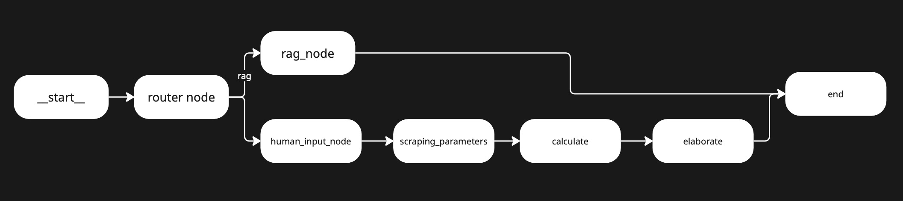
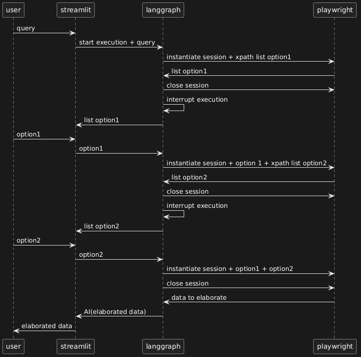

# RAG IPF Wiki
 
At the moment we are updating the documentation, the scope of the full-stack GenAI application in Python has grown, from a RAG acting like a professional financial advisor, to incorporate workflows and agentic features.

- The agent is able to retrieve pieces of information from the [subreddit](https://www.reddit.com/r/ItaliaPersonalFinance/) Italian Personal Finance's [Wiki](https://www.italiapersonalfinance.it).
- The agent is able to calculate whether, based on the user's conditions, what's more convenient, between renting or buying an house.
 
The aim is to deliver an industry-grade, production-ready piece of Python application, which follows all the best practices for software engineering, coding, data science, and GenAI — from following PEP-8 recommendations, to containerizing software to ensure reproducibility and isolation, to properly cleaning data.
 
While we acknowledge there are much more direct solutions to implement some functionalities, such as using an already-built MCP to retrieve data, most of the features, as well as layers of abstraction and error handling, were included for learning purposes, coded *from scratch and entirely by a human*, both front-end and back-end.

Currently, two releases are available:
- v0.1, released on the 14th of April 2026, which implemented the `RAG`, a `Streamlit UI`, containerization in `Docker` and deployment in `Google Cloud Platform`;
- v0.2, released on the 27th of April 2026, enabling a `LangGraph` workflow using a human-in-the-loop design, as well as web scraping and interaction in `Playwright` for `Rent vs. Buy` calculator.

The application relies on several layers:
 
- Data ingestion and cleaning: in the `LangChain` environment, web crawling using `TavilyMap` for sitemap creation and `BeautifulSoup` for HTML data scraping;
- RAG implementation: naive semantic chunking using `NumPy`, vectorization using `OpenAI`, and storing in `MongoDB Atlas`;
- RAG hardening: hybrid search using `BM25`, `RRF` for ensembling and reranking using Cross-Encoding;
- Developing workflows in `LangGraph` with `human-in-the-loop`: `Rent vs. Buy` tool using `Playwright` for web page interactions and collecting domain user requirements;
- Building a front-end in `Streamlit`, allowing chat history storage between reruns for each user session, as well as citations rendering, and state management for persistance;
- Local containerization using `Docker`;
- Web hosting using `Google Cloud Platform` and its tools: `Artifact Registry`, `Secret Manager`, and `Google Cloud Run`.

# Demo

 
# Architectural choices about web crawling and data cleaning (v0.1)

The purpose of `Retrieval-Augmumented Generation` (`RAG`) consists in delivering to the model some additional data to enlarge its knoweldge. The better the data delivered, the better the model and RAG performance.

It was decided to enalarge the knowledge of the model using the [subreddit](https://www.reddit.com/r/ItaliaPersonalFinance/) Italian Personal Finance's [Wiki](https://www.italiapersonalfinance.it): a website having an online-encyclopedia strucuture, where each page contains in-depth analysis for a specific topic.

After inspecting the returned webpages using the `requests` module, we found that the main content of the pages was consistently enclosed in an HTML `<article>` tag, and within that, inside `<p>` and `<h#>` tags. Then, `BeautifulSoup` was used to keep only relevant content based on the aforementioned criteria. The `CleanerScraper` class was created, gathering data extraction and cleaning functionalities.
 
 
# Architectural choices about RAG implementation (v0.1)
 
Embedding a text consists in translating human language into something that the machine can elaborate. Embedding a piece of human-language information consists in creating numerical representations of words, sentences, or whole paragraphs. Such numerical representations are vectors — lists of numbers where each number refers to some semantic feature of the word, like genre, number, color, etc. RAG consist in enlarging the context of the query, computing similarity between embedded user input and embedded additional data. The higher the similarity, the higher the chance the query refers to the data, which will be used to enlarge the knowledge of the model.
 
A common practice before embedding a document to optimize performance consists in dividing — or *chunking* — the whole text, sometimes referred to as the *corpus*, into smaller bits called *chunks*. Embedding sentences or paragraphs rather than individual words allows each vector to incorporate both word-level information and its broader context.
 
After chunking, the sentences are *translated* into vectors via an embedding model and usually stored in a vector database.
 
## Semantic chunking
 
The Wiki was well organized, and its pages concise, brief and direct, for that reason semantic chunking approach might have be considered an overkill solution. However, it was still chosen and coded for educational purposes.
 
Semantic chunking consists of splitting the original text into chunks using punctuation or line breaks, assuming that each sentence — delimited by strong punctuation or a line break — carries a complete meaning. The similarity between each vector and its consecutive one was iteratively calculated, and once it exceeded a certain threshold, a new, larger chunk was created by aggregation. The goal was to obtain a smaller number of chunks containing mutually coherent information.

 
- The splitting by punctuation was realized thanks to `RecursiveTextSplitter` from `LangChain`;
- Using an `OpenAI` embedding model, each chunk was vectorized and, leveraging the `NumPy` library, the cosine similarity was computed for each pair of consecutive chunks;
- Once the text chunks are created, new embeddings are created and stored in `MongoDB Atlas`;
- The `SemanticChunker` class incorporates the whole tool.
 
## RAG Hardening: Hybrid Search using BM25
 
Hybrid search consists of an ensembling method that combines the advantages of `Vector Search` (`VS`) — the approach implemented to find similar vectors using cosine similarity — with `Full-text Search` (`FTS`), a retrieval method that deems a document relevant according to the occurrence of the query terms within it.
 
While VS scores relevancy was based on cosine similarity, `Best Match 25` (`BM25`) was implemented to calculate similarity scores for `FTS`. `BM25` extends the features of the more traditional Tf-IDF algorithm, which scores the relevancy of documents for a query of words based on their occurrence in the corpus. Like `Tf-IDF`, `BM25` positively scores documents where a word occurs most frequently, and scales down the score if the word occurs in many documents. `BM25` introduces document length normalization, promoting smaller documents, and term frequency saturation, tweaking the influence of term frequency in the similarity score.
 
The two search methods produce two rankings, so an ensembled ranking is created using a `Reciprocal Rank Fusion` (`RRF`) algorithm, natively implemented via `MongoDB Atlas`. `RRF` combines rankings from two sources by summing the reciprocals of each document's rank across both methods, weighted by a constant. The higher a document is ranked by different scoring algorithms, the higher it will appear in the final ranking.
 
## Cross-Encoding for Re-Ranking
 
`Cross-encoding` is a technique used to allow the LLM to retrieve only a subset of the most relevant documents to enhance generation performance. Compared to `Bi-Encoder`, where query and document vectors are encoded separately and their embeddings compared (for VS), `Cross-encoding` encodes both the query and the document within the same transformer, resulting in a similarity score between them. The `Cohere Rerank API` was used to perform this step.

# Implementing workflows in `LangGraph` with `human-in-the-loop`: `Rent vs. Buy` tool using `Playwright` for web page interactions and collecting domain user requirements (v0.2)

The scope of `v0.2` consisted in equipping the chatbot with agentic capabilities. In particular, with the development of the *Rent vs. Buy* module, it is possible to determine the convenience buying or renting any given property. 
**Please note:** It should be noted that the workflow is not a ReAct agent, but consists of a process that is almost entirely deterministic due to the specific nature of web-based interactions. The development of a ReAct agent is, however, envisaged for future development. 

At a router node upstream of the graph, an LLM determines the topic of the query: if it is a factual question, the RAG branch will be activated; if it concerns the convenience of buying a house, the branch of the graph relating to `Rent vs. Buy` will be activated.



Calculations are based on Prof. Paolo Coletti's [video](https://youtu.be/mvsyyxsFrYA?si=0E2AxClDcqNHf12e) "Acquistare prima casa o affitto?". The video shows a basic calculator in excel to determine whether it's more convenient to buy an house, or renting one. The *Rent vs. Buy* calculator we designed, implements such features in Python and enlarges the scope, introducing additional variables like the presence of alternative investments, italian taxation according to the nature of the seller, the location of the property in a specific geographic area, and the amortization of purchase costs and periodic maintenance costs.

## Acquiring the input: scraping with Playwright and human feedback using HITL

The *Rent vs. Buy* calculator requires inputs from different sources: some figures are provided directly by the user, while others are chosen by the user among options obtained by scraping the website of the Italian Tax Agency. The website provides average renting fees and purchasing prices per sqm, for a given geographical area. The workflow is able to determine whether the price is fair, compared to the average, and what would be a fair rent to pay for the same house, for any given location.

While a first iteration was realized using `Selenium`, the scraping feature was finally implemented using `Playwright`, which, unlike the static scraping used for the `RAG`, allows dynamic interaction with the page. Webpage elements were identified thanks to their `XPATH`s
The flow consists in:



The `interrupt` module in `langgraph.types` allows you to interrupt the execution of a graph at a specific point, returning to the frontend any payload passed as an argument. In this specific case, the payload consists of the options from which the user can select their preference. The `Command` module allows you to resume execution by selecting the preferred option as `resume`. 

**To fix**: as shown in the chart above, the state of the Playwright session is not maintained between interruptions, so the browser must be initialised each time. `v0.3` will maintain session persistence to reduce latency.

 
# Architectural choices about the front-end in Streamlit (v0.2)

`Streamlit` was used as the front-end framework, given its simplicity and native chat elements: `chat_message`, which renders a container storing chat history messages, and `chat_input`, which renders a widget handling input prompting.

Although v0.1 UI implementation went smoothly, thanks to outputs consistency from the backend, the biggest challenge for v0.2 was a mindset shift: learning to keep the UI completely agnostic from the backend's conditional logic. Instead of hardcoding rendering scenario like "if A is selected, render B" into the rendering layer, the UI simply reflects what it receives from the backend. A further layer of complexity came from Streamlit's volatility: every user interaction let the UI re-renders completely, forgetting interaction history and any previously rendered widgets, unless they are explicitly persisted `via session_state`, `Streamlit`'s mechanism for maintaining state across reruns.

Below is some pseudocode illustrating the approach used to render different widgets depending on the backend’s responses. Note that, although the backend requires the rendering of certain widgets to be sequential and dependent on the rendering of others, the frontend is completely agnostic to this logic and simply displays different widgets depending on the messages received from the backend.


```
/app.py

IMPORT STREAMLIT AS ST

IF LAST RESPONSE IS "INTERRUPT" AND INTERRUPT STEP IS "FIRST STEP":
    RENDER FORM
    IF CLICK SUBMIT AND RERUN APP:
        STORE DATA
        DISPLAY WIDGET DATA AND SAVE WIDGET IN MEMORY
        STORE "I CLICKED SUBMIT IN THE PAST RERUN"

    IF "I CLICKED SUBMIT IN THE PAST RERUN"
        RESUME GRAPH WITH STORED DATA
        DISPLAY GRAPH ANSWER AND SAVE WIDGET ANSWER IN MEMORY
        STORE "I DIDN'T CLICK SUBMIT IN THE PAST RERUN"

IF LAST RESPONSE IS "INTERRUPT" AND INTERRUPT STEP IS "SECOND STEP":
...

>>> streamlit run app.py
```

**To fix:** While the citations rendering was implemented for v0.1, and rendered into an `expander` container to increase both credibility and readability, they were lifted in v0.2, and foreseeton to be reimplemented in v0.3
 
 
# Architectural choices about local deployment in Docker (v0.2)
 
The first local release of the project was packaged using `Docker`
A `Dockerfile` created an image from a lightweight Python base with the `uv` package manager installed. `Playwright` dependecies installation commands were included and port 8080 was exposed to reach `Streamlit`, instead of the default 8501, as per the `Google Cloud Run` docs, to make one image compatible with the web hosting environment as well.
 
 
# Architectural choices about web deployment in GCP (v0.1)
 
While possibly subject to changes for future deployments, it was decided to build an image locally and push it to the web.
 
The main steps for web deployment consisted in:
 
- Temporarily allowing web traffic to the `MongoDB Atlas` server so that `Google Cloud Run` can reach it for RAG:
 
```
go to https://cloud.mongodb.com
Security -> Database & Network Access -> Network Access -> IP Access List -> ADD IP ADDRESS (0.0.0.0/0)
```
 
- Storing secrets, like API keys, following the Google documentation about [creating a secret](https://docs.cloud.google.com/secret-manager/docs/creating-and-accessing-secrets#gcloud_1) and [adding a value to a secret](https://docs.cloud.google.com/secret-manager/docs/add-secret-version). Given the small number of secrets, those were entered manually;
- Allowing the developer account to access secrets, following the Google [documentation](https://docs.cloud.google.com/secret-manager/docs/manage-access-to-secrets);
- Pushing the Docker image to `Artifact Registry` following the Google [documentation](https://docs.cloud.google.com/artifact-registry/docs/docker/store-docker-container-images#create);
- Running the container in `Cloud Run`, following this [tutorial](https://medium.com/@ntepp.marcus/deploy-your-side-project-in-minutes-a-beginners-guide-to-google-cloud-run-artifact-registry-f5475240595f).


# Open points for v0.3
- Improving docstrings and comments for v0.2 to ensure reproducibility and understanding;
- Adding an helper in UI listing possible tools;
- Adding a "Reproducibility" paragraph, listing possible approach;
- Adding "Use of AI" paragraph, assessing AI use for the development project;
- Defining and developing agentic features or replacing current architecture with ReAct's;
- Rendering RAG citations in UI streamlit;
- Making Playwright session persistence across interrupts;
- Considering multicontainer architecture for 0.3;
- Deployment of v0.3 in GCP.